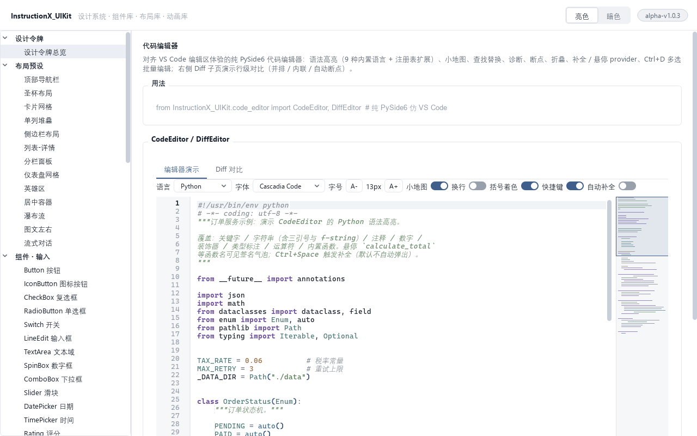

# InstructionX_UIKit

基于 PySide6（Qt for Python）的纯桌面 UI 组件库：设计令牌 + 亮/暗双主题、58 个组件、13 个响应式布局预设、52 个动画预设、原生图表引擎、蓝图节点图编辑器与仿 VS Code 代码编辑器。


## 特性

- **设计令牌 + 双主题**：色彩 / 字体 / 间距 / 圆角 / 阴影 / 断点 / 动效全部令牌化，`ThemeManager` 一键切换亮 / 暗主题，无需重启，全部组件实时热切换（**暗色主题目前为实验性功能**，个别组件的细节表现仍在打磨）。
- **58 个组件**：输入 / 展示 / 反馈三大类，动态属性 + 全局 QSS 驱动，统一 sm / md / lg 尺寸体系与状态矩阵（hover / pressed / disabled / focus）。
- **13 个响应式布局预设**：API 驱动的工厂函数（`create_card_grid(items=...)` 等），基于断点的响应式重排，空数据自动显示优雅占位。
- **52 个动画预设**：28 个属性动画（快照覆盖层方案，规避 Qt6 + QSS + 高 DPI 下 QGraphicsEffect 失效问题）+ 24 个 QTimer 自绘动画组件。
- **原生图表引擎**：纯 QPainter 实现的 ECharts 风格图表，不依赖 WebView / JavaScript；`set_option` 数据驱动，**21 种系列**（直角坐标 / 层级占比 / 关系流向 / 极坐标 / 日历 / 地图 / 平行坐标）、9 种组件（标题 / 图例 / tooltip / markPoint / markLine / markArea / graphic / map / toolbox），主题感知实时换肤。
- **OpenGL 渲染与大规模数据**：绘制由 GPU 视口承载（`QOpenGLWidget`，公共 API 零变化；GL 不可用时自动回退软件光栅）；**150 万点单帧 5 ms 级**，运行时按「绘图区像素宽」自动降采样并保证**逐像素列 y 极值与全量直绘严格一致**；数据的紧凑存储与零拷贝摄入使 `set_option` 不再深拷贝百万级数组；`series.gpuDirect` 可把折线顶点直接交给 VBO + GLSL（实测 150 万点 0.3 ms 级）。
- **实时数据接入**：`chart.stream()` 提供无锁环形缓冲（单写单读）+ 帧合并（不丢点）+ 定时入图；生产者在任意线程写入、界面按刷新节奏取数，滚动窗口写满丢最旧。
- **蓝图节点图**：类 UE5 Blueprint / ComfyUI 的节点图编辑器，支持右键建节点、引脚拖线、类型校验、序列化与执行状态模拟。
- **代码编辑器**：纯 PySide6（无 WebView）对齐 VS Code 编辑区体验——语法高亮（9 种内置语言 + 注册表扩展）、小地图、查找替换、诊断 / 断点 / 折叠、补全与悬停 provider、Ctrl+D 多选批量编辑，另含并排 / 内联 / 自动断点的 Diff 对比编辑器。
- **职责分离**：`InstructionX_UIKit/` 为纯 Kit 包（零假数据、零 Demo 逻辑，一切内容由调用方 API 传入，无内容时显示优雅空占位）；`demo/` 为独立演示程序（**11 大类、78 个演示页**，每页顶部附「用法」代码示例）。

## 界面预览

| 亮色主题 | 暗色主题 |
|---|---|
|  |  |

| 原生图表引擎 | 图表 · 暗色 |
|---|---|
|  |  |

| 响应式仪表盘布局 | 蓝图节点图 |
|---|---|
|  |  |

| 代码编辑器（仿 VS Code） | |
|---|---|
|  | |

| 自绘动画（24 预设） | |
|---|---|
|  | |

## 安装

```bash
pip install -r requirements.txt
# 官方源较慢时可用镜像：
# pip install -r requirements.txt -i https://mirrors.aliyun.com/pypi/simple/
```

依赖：`PySide6>=6.11.1`（含 Addons）、`qrcode[pil]>=7.4`、`matplotlib>=3.11.1`（MarkdownView 的 LaTeX 公式渲染）与 `numpy>=2.0`（图表引擎大规模数据管线：紧凑存储、向量化降采样与坐标映射、分层采样金字塔），除此之外无任何第三方依赖。

## 快速上手

```python
import sys
from PySide6.QtWidgets import QApplication, QVBoxLayout, QWidget

from InstructionX_UIKit.theme import ThemeManager
from InstructionX_UIKit.components import Button, LineEdit, Statistic, Switch
from InstructionX_UIKit.layouts import create_card_grid

app = QApplication(sys.argv)
ThemeManager.instance().apply(app)          # 应用全局主题（默认亮色）

win = QWidget()
lay = QVBoxLayout(win)

lay.addWidget(Statistic(title="活跃用户", value=24317))
lay.addWidget(LineEdit(placeholder="请输入关键词"))
lay.addWidget(Button("确定", variant="primary"))
lay.addWidget(Switch(checked=True))

# 布局为 API 驱动：内容由调用方传入
grid = create_card_grid(items=[
    ("数据看板", "汇总关键指标。", "color.primary.subtle"),
    ("任务中心", "展示待办与进度。", "color.success.subtle"),
])
lay.addWidget(grid, 1)

win.resize(720, 560)
win.show()
sys.exit(app.exec())
```

切换暗色主题（无需重启，全部组件实时换肤；**暗色主题为实验性功能**）：

```python
tm = ThemeManager.instance()
tm.set_mode("dark")   # 或 tm.toggle() 亮暗互切
```

## 运行 Demo

```bash
python main.py
```

左侧导航含：设计令牌 / 布局预设（13）/ 组件·输入 / 组件·展示 / 组件·反馈 / 动画·属性（28）/ 动画·自绘（24）/ 基础控件 / 图表（21 系列 + 巨量数据与实时滚动流演示）/ 蓝图（节点图）/ 代码编辑器（编辑器 + Diff），共 11 大类 78 页。顶栏可随时切换亮 / 暗主题（实验性）；每个演示页顶部有「用法」代码标签，看 Demo 即可学会对应 API 的调用方式。

**图表页的巨量数据演示**：`1,500,000` 点起（可拉到 500 万）实时重建，读数直接给出「实际渲染点数 / QPainter 单帧 / GPU 直绘单帧 / 90 fps 预算判定」；「实时滚动流」开关模拟约 1000 点/秒的传感器，读数给出实测入图频率、采样吞吐与单帧绘制耗时。判定帧率是否达标请看**单帧绘制耗时**（90 fps 预算 11.1 ms）——端到端帧率受显示器垂直同步约束，不能反映图表能力。

## 项目结构

```
项目根/
├── InstructionX_UIKit/          # 纯 Kit 包（零假数据、零 Demo 逻辑）
│   ├── tokens.py                # 设计令牌（唯一数值来源 + TokenState）
│   ├── theme.py                 # ThemeManager + 全局 QSS 生成
│   ├── icons.py                 # QPainter 运行时矢量图标集
│   ├── components/              # 58 个组件（输入 / 展示 / 反馈）
│   ├── layouts/                 # 13 个响应式布局预设（API 驱动）
│   ├── anim/                    # 28 属性动画 + 24 自绘动画
│   ├── charts/                  # 原生图表引擎（ECharts 风格）
│   │   ├── core.py              #   ChartWidget（set_option / update_option）+ 分层渲染缓存
│   │   ├── viewport.py          #   GL / 软件双视口（UIKIT_CHART_GL 控制，offscreen 自动回退）
│   │   ├── data.py              #   紧凑存储与零拷贝摄入（大规模数据管线）
│   │   ├── sampling.py          #   运行时降采样与「逐像素列极值一致」保真承诺
│   │   ├── stream.py            #   实时接入：RingBuffer / FrameCoalescer / StreamSession
│   │   ├── gl_series.py         #   GPU 原生直绘管线（VBO + GLSL）
│   │   ├── axes.py              #   坐标系与轴模型
│   │   ├── series_cartesian.py  #   直角坐标 / 单轴 / 平行坐标 / 日历系列
│   │   ├── series_hierarchy.py  #   pie / radar / gauge / tree / treemap / sankey / graph
│   │   ├── components.py        #   图表组件（markPoint / markLine / graphic / map …）
│   │   ├── interact.py          #   dataZoom / brush / visualMap / timeline / toolbox
│   │   └── pyramid.py           #   分层采样金字塔（可选组件，默认不接入）
│   ├── blueprint/               # 蓝图节点图（模型 / 画布 / 连线 / 菜单 / 执行模拟）
│   └── code_editor/             # 仿 VS Code 代码编辑器（高亮 / 小地图 / Diff）
├── demo/                        # 独立 Demo 程序（11 大类、78 演示页，惰性加载）
├── docs/                        # Design.md（设计规范）/ USAGE.md（使用手册）/ screenshots/
├── main.py                      # Demo 启动入口
└── requirements.txt
```

## 分支与测试

| 分支 | 内容 |
|---|---|
| `main` / `dev` | 仅项目源码与文档，不含测试代码 |
| `test` | 完整源码 + 全部离屏自测（`tests/`，含截图回归） |

测试为独立可执行脚本（无 pytest 依赖），退出码 0 即通过：

```powershell
git switch test
# Windows PowerShell；offscreen 平台需指定系统字体目录，否则文本渲染为豆腐块
$env:QT_QPA_PLATFORM="offscreen"; $env:QT_QPA_FONTDIR="C:\Windows\Fonts"
python tests\test_core.py
```

## 文档

- [docs/Design.md](docs/Design.md) — 设计规范（令牌数值、断点、动效、状态矩阵、暗色策略）
- [docs/USAGE.md](docs/USAGE.md) — 使用手册，共 11 章：
  - §1–§7 安装 / 快速开始 / 主题系统 / 组件 / 布局 / 动画 / 图表用法
  - **§8 大数据与实时渲染** — 渲染后端（GPU 与软件双视口）、自动降采样与保真承诺、实时数据接入（`chart.stream()`）、GPU 原生直绘（`gpuDirect`）、同屏多图性能特征
  - §9 蓝图模式 · §10 代码编辑器 · §11 常见问题

## 仓库

`https://github.com/KKPIP-Tech/InstructionX_UIKit.git`
